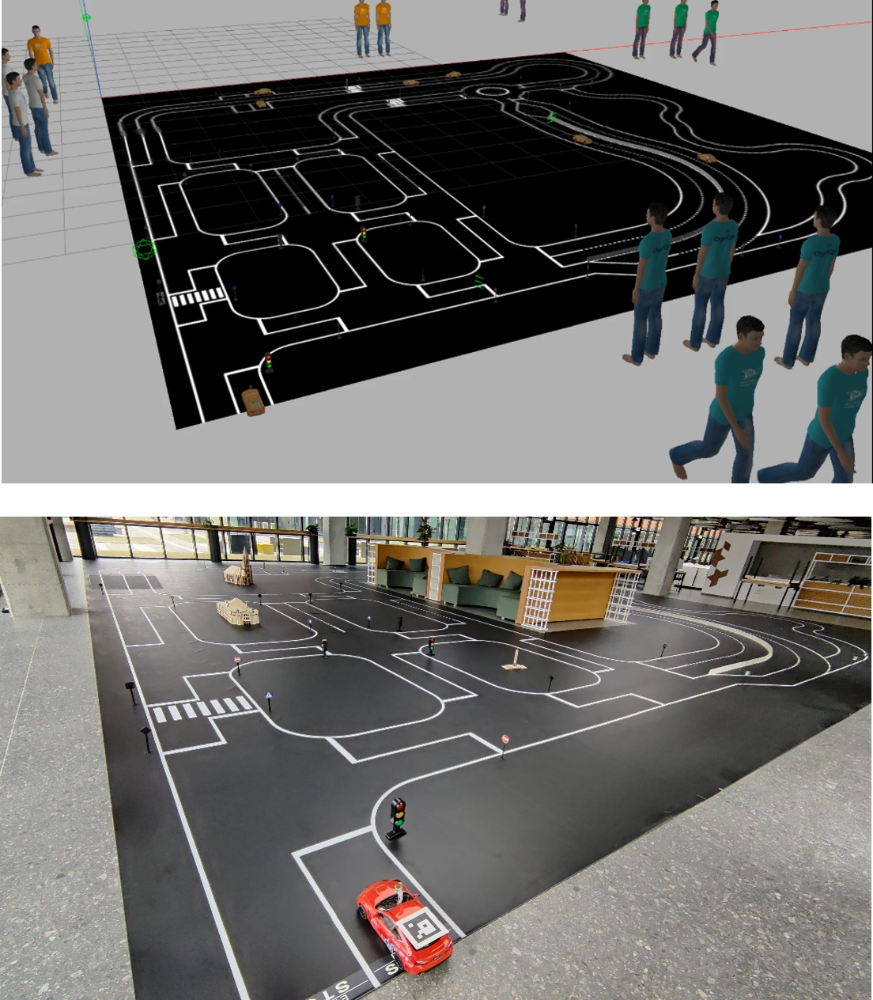

<p align="center">
  
</p>

# BFMC Simulator ROS (Gazebo 11 & ROS Noetic)

Repository chứa toàn bộ mã nguồn mô phỏng Gazebo cho cuộc thi **Bosch Future Mobility Challenge (BFMC)**, bao gồm mô hình xe Automobile 1:10, các sa hình tùy chỉnh (Đường tròn căn chỉnh camera, Đường đua nhiều khúc cua uốn lượn) và Sa hình thi đấu chuẩn của BTC với đầy đủ các vật thể (biển báo, đèn giao thông, người đi bộ, xe cản).

---

## Hướng dẫn cài đặt và Chạy mô phỏng (Docker)

Sử dụng Docker là phương án chuẩn nhất của ban tổ chức BFMC, đảm bảo môi trường ROS Noetic, Gazebo 11 và các thư viện C++ tương thích 100%.

### 1. Clone repository về máy Host
```bash
git clone https://github.com/DanhCon/BFMC_Simulator_ROS.git
cd BFMC_Simulator_ROS
```

### 2. Cấp quyền hiển thị GUI & Khởi động Docker Container
Cấp quyền cho Docker truy cập X11 Display của máy host để mở giao diện đồ họa Gazebo:
```bash
xhost +local:root
docker start bfmc_sim
```
*(Ghi chú: Thay `bfmc_sim` bằng tên container Docker của bạn nếu đặt tên khác).*

### 3. Đồng bộ mã nguồn vào workspace trong Docker
Copy toàn bộ mã nguồn từ máy host vào thư mục `src` của catkin workspace bên trong container:
```bash
docker cp . bfmc_sim:/root/bfmc_simulator_ws/src/
```

### 4. Build Workspace
Biên dịch các gói ROS và Gazebo plugins (chỉ cần chạy lần đầu hoặc khi chỉnh sửa plugin C++):
```bash
docker exec -it bfmc_sim bash -c \
  "source /opt/ros/noetic/setup.bash && cd /root/bfmc_simulator_ws && catkin_make"
```

---

## Khởi chạy mô phỏng (Gazebo Simulation)

> [!IMPORTANT]
> Luôn luôn cần export `GAZEBO_MODEL_PATH` và `GAZEBO_RESOURCE_PATH` để Gazebo nạp đầy đủ các mesh 3D và vật thể trong `models_pkg`.

### Tùy chọn 1: Đường đua nhiều khúc cua (Curved Track)
Đường đua uốn lượn chuyên dụng để kiểm thử thuật toán bám làn (Lane Following), nhận diện vạch kẻ đường liên tục:
```bash
docker exec -it -e DISPLAY=:0 bfmc_sim bash -c \
  "source /opt/ros/noetic/setup.bash && \
   source /root/bfmc_simulator_ws/devel/setup.bash && \
   export GAZEBO_MODEL_PATH=/root/bfmc_simulator_ws/src/src/models_pkg:\$GAZEBO_MODEL_PATH && \
   export GAZEBO_RESOURCE_PATH=/root/bfmc_simulator_ws/src/src/models_pkg:\$GAZEBO_RESOURCE_PATH && \
   roslaunch sim_pkg curved_track.launch"
```

### Tùy chọn 2: Đường đua vòng tròn (Circle Track 10m)
Đường đua vòng tròn chuẩn bán kính 5m (chu vi ~31.4m) giúp căn chỉnh ma trận Bird's-Eye-View (BEV) và độ chính xác góc lái:
```bash
docker exec -it -e DISPLAY=:0 bfmc_sim bash -c \
  "source /opt/ros/noetic/setup.bash && \
   source /root/bfmc_simulator_ws/devel/setup.bash && \
   export GAZEBO_MODEL_PATH=/root/bfmc_simulator_ws/src/src/models_pkg:\$GAZEBO_MODEL_PATH && \
   export GAZEBO_RESOURCE_PATH=/root/bfmc_simulator_ws/src/src/models_pkg:\$GAZEBO_RESOURCE_PATH && \
   roslaunch sim_pkg circle_track.launch"
```

### Tùy chọn 3: Sa hình thi đấu chuẩn BTC (Full Map với Biển báo & Đèn giao thông)
Sa hình chính thức của BFMC gồm đầy đủ biển báo, vạch người đi bộ, đèn tín hiệu và chướng ngại vật:
```bash
docker exec -it -e DISPLAY=:0 bfmc_sim bash -c \
  "source /opt/ros/noetic/setup.bash && \
   source /root/bfmc_simulator_ws/devel/setup.bash && \
   export GAZEBO_MODEL_PATH=/root/bfmc_simulator_ws/src/src/models_pkg:\$GAZEBO_MODEL_PATH && \
   export GAZEBO_RESOURCE_PATH=/root/bfmc_simulator_ws/src/src/models_pkg:\$GAZEBO_RESOURCE_PATH && \
   roslaunch sim_pkg map_with_car.launch"
```

---

## Điều khiển xe & Công cụ hỗ trợ

### 1. Điều khiển xe bằng bàn phím (Smart Teleop Keyboard)
Mở một terminal mới trên máy host và chạy:
```bash
docker exec -it bfmc_sim bash -c \
  "source /opt/ros/noetic/setup.bash && \
   source /root/bfmc_simulator_ws/devel/setup.bash && \
   python3 /root/bfmc_simulator_ws/src/src/example/src/teleop_keyboard.py"
```
* **Phím điều khiển:**
  * `W` / `Mũi tên lên`: Tiến / Tăng ga
  * `S` / `Mũi tên xuống`: Giảm ga / Phanh / Lùi
  * `A` / `D` (hoặc mũi tên Trái/Phải): Đánh lái (nhả phím tự động trả thẳng lái về 0°)
  * `Space`: Phanh khẩn cấp lập tức
  * `M`: Chuyển đổi giữa chế độ `ARCADE` (tự trả lái & tự giảm ga) và `CRUISE` (khóa ga giữ tốc độ)
  * `Q`: Dừng xe và thoát

### 2. Xem hình ảnh Camera xe
```bash
docker exec -it -e DISPLAY=:0 bfmc_sim bash -c \
  "source /opt/ros/noetic/setup.bash && \
   source /root/bfmc_simulator_ws/devel/setup.bash && \
   python3 /root/bfmc_simulator_ws/src/src/example/src/camera_viewer.py"
```

### 3. Căn chỉnh phối cảnh Bird's-Eye-View (BEV Tuner)
```bash
docker exec -it -e DISPLAY=:0 bfmc_sim bash -c \
  "source /opt/ros/noetic/setup.bash && \
   source /root/bfmc_simulator_ws/devel/setup.bash && \
   python3 /root/bfmc_simulator_ws/src/src/example/src/step1_bev_tuner.py"
```

---

## Tài liệu tham khảo
- [BFMC Official Documentation](https://bosch-future-mobility-challenge-documentation.readthedocs-hosted.com/data/useful/simulator.html)
